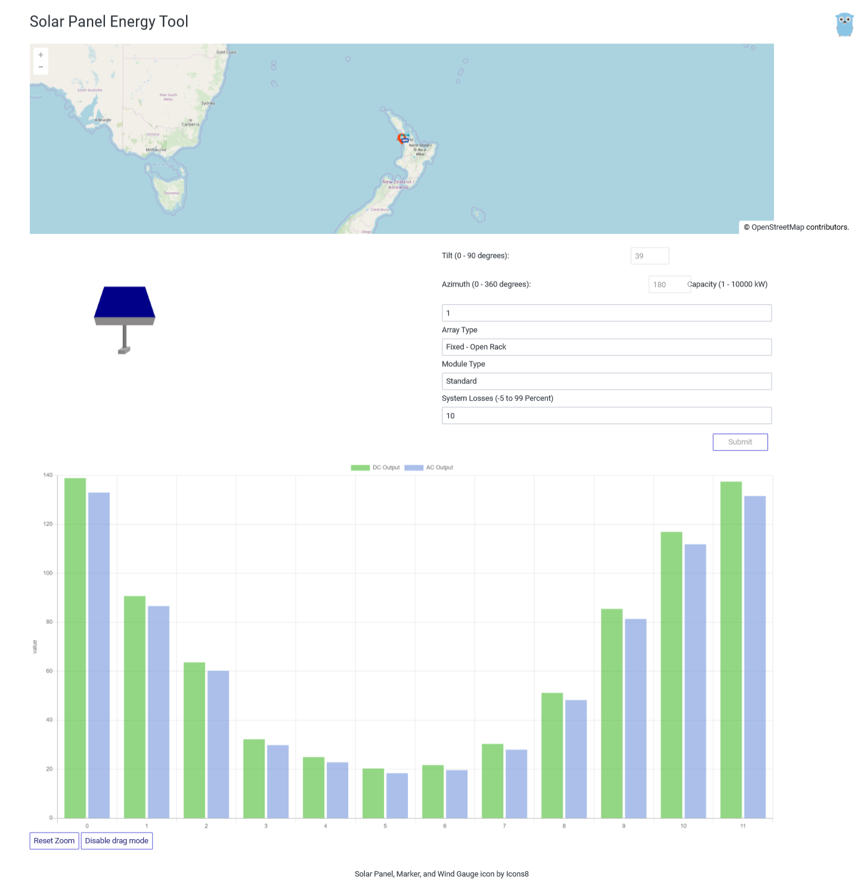

[](https://travis-ci.com/Jsuppers/gowatts)
[](https://coveralls.io/github/Jsuppers/gowatts?branch=master)

# gowatts
Gowatts is a simple Go program which estimates power output of a solar panel system depending on it's location and orientation.



## How to run
```
docker build -t gowatts . 
docker run -p 8080:8080 gowatts
```
## PVWatts
gowatts uses PVWatts (https://pvwatts.nrel.gov/) to estimate power output. This is limited to 50 requests per hour per IP Address. To do more requests please option a API key at https://developer.nrel.gov/ and set the PVWATTS_API_KEY environment variable.
